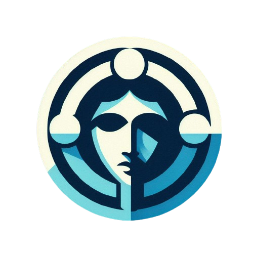

<!-- Improved compatibility of back to top link: See: https://github.com/othneildrew/Best-README-Template/pull/73 -->

<!--
*** Thanks for checking out the Best-README-Template. If you have a suggestion
*** that would make this better, please fork the repo and create a pull request
*** or simply open an issue with the tag "enhancement".
*** Don't forget to give the project a star!
*** Thanks again! Now go create something AMAZING! :D
-->

> [!WARNING]
> This Project is a Work-In-Progress and isnt yet functional, please check it out again in a few days. Thank You!

<!-- PROJECT SHIELDS -->
<!--
*** I'm using markdown "reference style" links for readability.
*** Reference links are enclosed in brackets [ ] instead of parentheses ( ).
*** See the bottom of this document for the declaration of the reference variables
*** for contributors-url, forks-url, etc. This is an optional, concise syntax you may use.
*** https://www.markdownguide.org/basic-syntax/#reference-style-links
-->
[![Contributors][contributors-shield]][contributors-url]
[![Forks][forks-shield]][forks-url]
[![Stargazers][stars-shield]][stars-url]
[![Issues][issues-shield]][issues-url]

<!-- PROJECT LOGO -->
 

  

  <h3 align="center">Hermetis</h3>

  

    An open source status page that works with real-time data and offers API integration.
     
    <a href="https://github.com/Magnet-js/Hermetis"><strong>Explore the docs »</strong></a>
     
     
    <a href="https://github.com/Magnet-js/Hermetis">View Demo</a>
    ·
    <a href="https://github.com/Magnet-js/Hermetis/issues/new?labels=bug&template=bug-report---.md">Report Bug</a>
    ·
    <a href="https://github.com/Magnet-js/Hermetis/issues/new?labels=enhancement&template=feature-request---.md">Request Feature</a>
  

<!-- TABLE OF CONTENTS -->

  
Table of Contents

  <ol>
    <li>
      <a href="#about-the-project">About The Project</a>
      <ul>
        <li><a href="#built-with">Built With</a></li>
      </ul>
    </li>
    <li>
      <a href="#getting-started">Getting Started</a>
      <ul>
        <li><a href="#prerequisites">Prerequisites</a></li>
        <li><a href="#installation">Installation</a></li>
      </ul>
    </li>
    <li><a href="#usage">Usage</a></li>
    <li><a href="#roadmap">Roadmap</a></li>
    <li><a href="#contributing">Contributing</a></li>
    <li><a href="#license">License</a></li>
    <li><a href="#contact">Contact</a></li>
    <li><a href="#acknowledgments">Acknowledgments</a></li>
  </ol>

<!-- ABOUT THE PROJECT -->
## About The Project

[![Hermetis Screenshot][product-screenshot]](https://hermetis.io)

**Hermetis** is an open-source status page designed for real-time system monitoring. The project is written in **Go** and **React (TypeScript)** and uses a **Postgres database** provided with Docker. So far, Hermetis is able to integrate data from the Proxmox Node API, with further integrations planned.
**Key features:**
* Real-time monitoring and status display
* API support for various platforms
* Docker-based deployment of PostgreSQL database for easy integration and scalability
* Extensible and customisable through future API integrations

(<a href="#readme-top">back to top</a>)

### Built With

This section should list any major frameworks/libraries used to bootstrap your project. Leave any add-ons/plugins for the acknowledgements section. Here are a few examples.

* [![Go][Go]][Go-url]
* [![React][React.js]][React-url]
* [![PostgreSQL][PostgreSQL]][PostgreSQL-url]
* [![Docker][Docker]][Docker-url]

(<a href="#readme-top">back to top</a>)

<!-- GETTING STARTED -->
## Getting Started

Here is a short guide to setting up the project locally.

### Prerequisites

- Docker and Docker Compose installed 
- Git installed

### Installation

Comming Soon...

(<a href="#readme-top">back to top</a>)

<!-- USAGE EXAMPLES -->
## Usage

<!-- The Hermetis API allows you to retrieve system status information and add custom integrations. For complete documentation, please visit [the documentation page](https://hermetis.io/docs) on our website. *(Documentation under development)* -->

(<a href="#readme-top">back to top</a>)

<!-- ROADMAP -->
## Roadmap

- [ ] Proxmox Node API integration 
- [ ] Support for further integrations (e.g. AWS, Kubernetes) 
- [ ] Further features on the website (e.g. live dashboard, API documentation) 
- [ ] Improved scalability and database support 

See the [open issues](https://github.com/Magnet-js/Hermetis/issues) for a full list of proposed features (and known issues). 

(<a href="#readme-top">back to top</a>)

<!-- CONTRIBUTING -->
## Contributing

Contributions are what make the open source community such an amazing place to learn, inspire, and create. Any contributions you make are **greatly appreciated**.

If you have a suggestion that would make this better, please fork the repo and create a pull request. You can also simply open an issue with the tag "enhancement".
Don't forget to give the project a star! Thanks again!

1. Fork the Project
2. Create your Feature Branch (`git checkout -b feature/AmazingFeature`)
3. Commit your Changes (`git commit -m 'Add some AmazingFeature'`)
4. Push to the Branch (`git push origin feature/AmazingFeature`)
5. Open a Pull Request

### Top contributors:

(<a href="#readme-top">back to top</a>)

<!-- LICENSE -->
## License

Distributed under the MIT License. See `LICENSE` for more information.

(<a href="#readme-top">back to top</a>)

<!-- CONTACT -->
## Contact

<!--Your Name - [@your_twitter](https://twitter.com/your_username) - email@example.com

Project Link: [https://github.com/your_username/repo_name](https://github.com/your_username/repo_name)

(<a href="#readme-top">back to top</a>)
-->

Comming Soon...

<!-- MARKDOWN LINKS & IMAGES -->
<!-- https://www.markdownguide.org/basic-syntax/#reference-style-links -->
[contributors-shield]: https://img.shields.io/github/contributors/Magnet-js/Hermetis.svg?style=for-the-badge
[contributors-url]: https://github.com/Magnet-js/Hermetis/graphs/contributors
[forks-shield]: https://img.shields.io/github/forks/Magnet-js/Hermetis.svg?style=for-the-badge
[forks-url]: https://github.com/Magnet-js/Hermetis/network/members
[stars-shield]: https://img.shields.io/github/stars/Magnet-js/Hermetis.svg?style=for-the-badge
[stars-url]: https://github.com/Magnet-js/Hermetis/stargazers
[issues-shield]: https://img.shields.io/github/issues/Magnet-js/Hermetis.svg?style=for-the-badge
[issues-url]: https://github.com/Magnet-js/Hermetis/issues
[product-screenshot]: images/screenshot.png

[React.js]: https://img.shields.io/badge/React-20232A?style=for-the-badge&logo=react&logoColor=61DAFB
[React-url]: https://reactjs.org/
[Go]: https://img.shields.io/badge/Go-00ADD8?logo=Go&logoColor=white&style=for-the-badge
[Go-url]: https://go.dev
[PostgreSQL]: https://img.shields.io/badge/postgresql-4169e1?style=for-the-badge&logo=postgresql&logoColor=white
[PostgreSQL-url]: https://www.postgresql.org/
[Docker]: https://img.shields.io/badge/docker-2496ED?style=for-the-badge&logo=docker&logoColor=white
[Docker-url]: https://www.postgresql.org/
